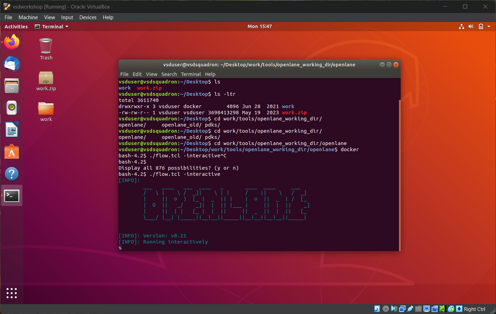

# RISC-V Development Workshop 🎓

<div align="center">
  
  <br>
  <em>Hands-on Learning with Advanced RISC-V Technology</em>
</div>

## Workshop Overview 🌟

Welcome to our comprehensive RISC-V development workshop! This hands-on learning experience focuses on embedded systems programming using cutting-edge RISC-V architecture. Through practical exercises and real-world applications, participants will master both fundamental and advanced concepts in microcontroller programming.

## Learning Objectives 📚

- Master RISC-V instruction set architecture
- Develop embedded systems applications
- Understand microcontroller peripherals
- Implement real-time applications
- Practice hardware-software integration

## Development Kit Specifications 🛠️

Our workshop utilizes a specialized development board featuring:

### Core Components
- Microcontroller: 32-bit RISC-V core
- Architecture: RV32EC instruction set
- System Clock: 24MHz
- Memory Configuration:
  - Program Memory: 16KB Flash
  - Data Memory: 2KB SRAM
  - Protected Bootloader: 1920B

### Interface Options
```
Communication Protocols:
├── Serial (UART)
│   ├── RX: PD6
│   └── TX: PD5
├── I2C Bus
│   ├── SDA: PC1
│   └── SCL: PC2
└── SPI Interface
    ├── SCK:  PC5
    ├── MOSI: PC6
    ├── MISO: PC7
    └── NSS:  PC1
```

## Workshop Setup Guide 💻

### System Requirements
- Computer with minimum 100GB free storage
- Operating System: Windows 10/11 or Ubuntu 20.04+
- USB Type-C cable
- Internet connection for software downloads

### Development Environment
1. **IDE Installation**
   - Download Visual Studio Code
   - Configure workspace settings
   - Install required extensions

2. **Board Configuration**
   <div align="center">
     
     <br>
     <em>System Integration Overview</em>
   </div>

## Laboratory Exercises 🔬

Our workshop includes hands-on exercises covering:

1. **Basic Operations**
   - GPIO configuration
   - LED control
   - Button interfacing

2. **Communication Protocols**
   - UART serial communication
   - I2C sensor integration
   - SPI device control

3. **Advanced Topics**
   - Interrupt handling
   - Timer configurations
   - ADC operations

## Troubleshooting Guide 🔧

### Common Issues and Solutions

1. **Connection Problems**
   - Verify USB cable connection
   - Check driver installation
   - Confirm port recognition

2. **Programming Issues**
   - Validate compiler settings
   - Check memory constraints
   - Verify correct boot mode

## Resources and Support 📱

- Workshop Materials: [Documentation Portal](#)
- Technical Support: support@workshop.com
- Community Forum: [Discussion Board](#)

## Safety Guidelines ⚠️

- Follow proper ESD precautions
- Maintain correct voltage levels
- Avoid short circuits
- Handle components with care

## Workshop Schedule 📅

- Duration: 2 Days
- Daily Sessions: 9 AM - 5 PM

## Environment setup

<div align="center">
  
  <br>
  <em>Ubuntu Environment Setup </em>
</div>
---
<div align="center">
Empowering Future Innovators in RISC-V Technology
</div>

## JAN 6

<div align="center">
  
  <br>
  <em>Setup of openlane and docker</em>
</div>
