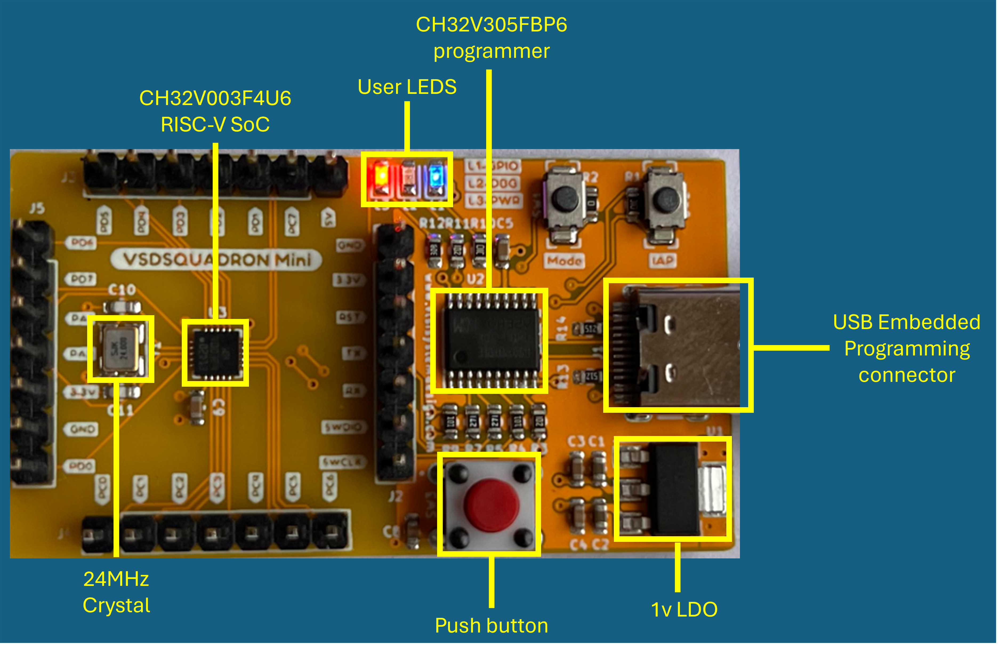
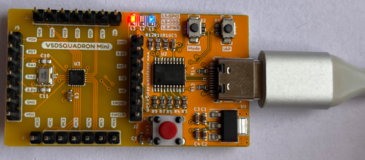
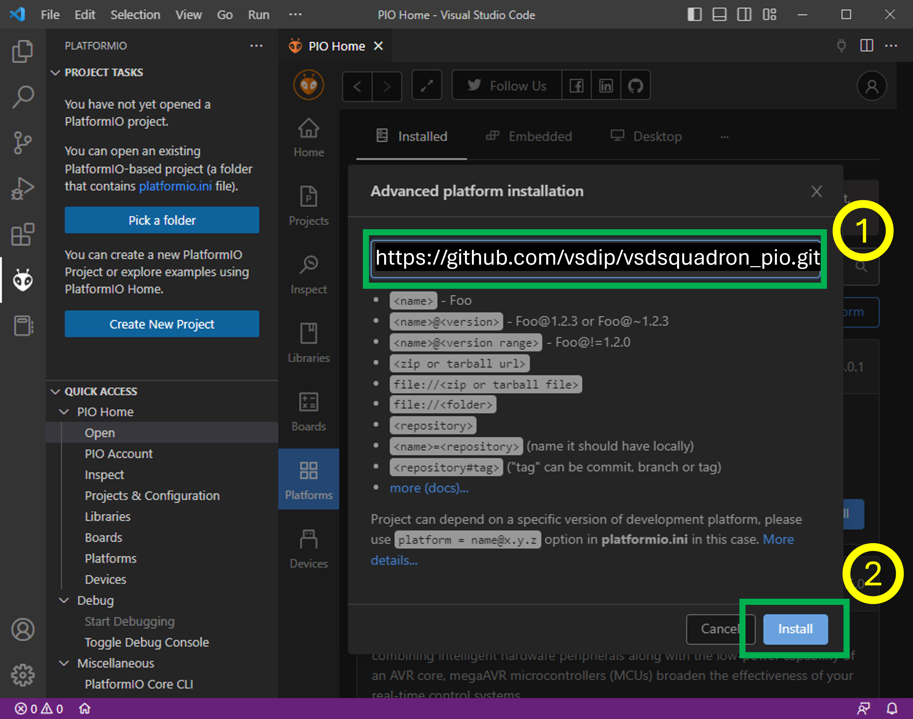
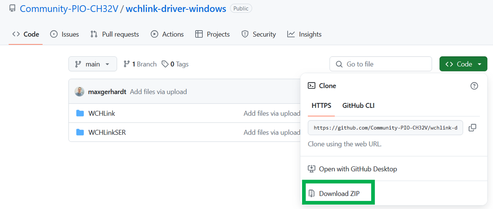
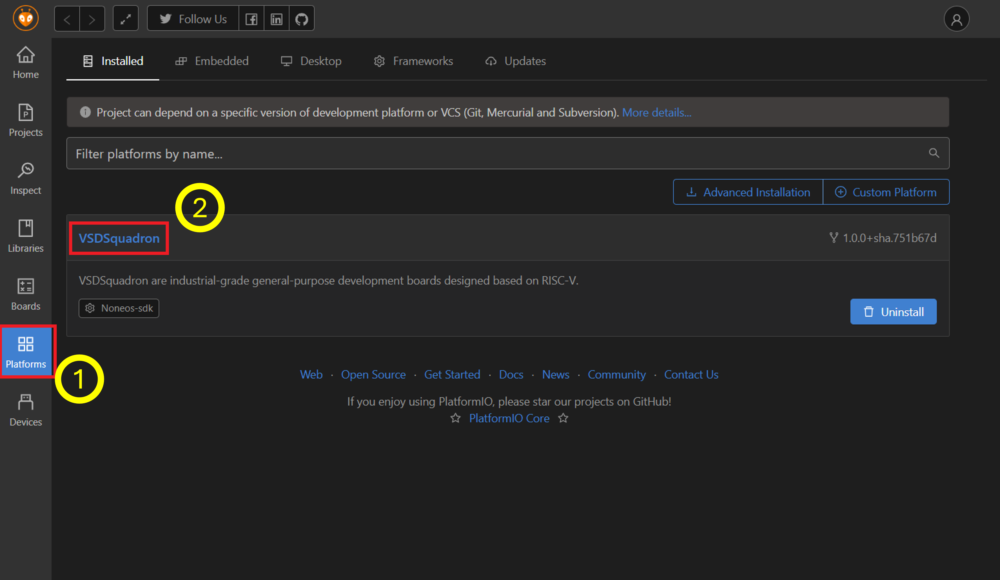
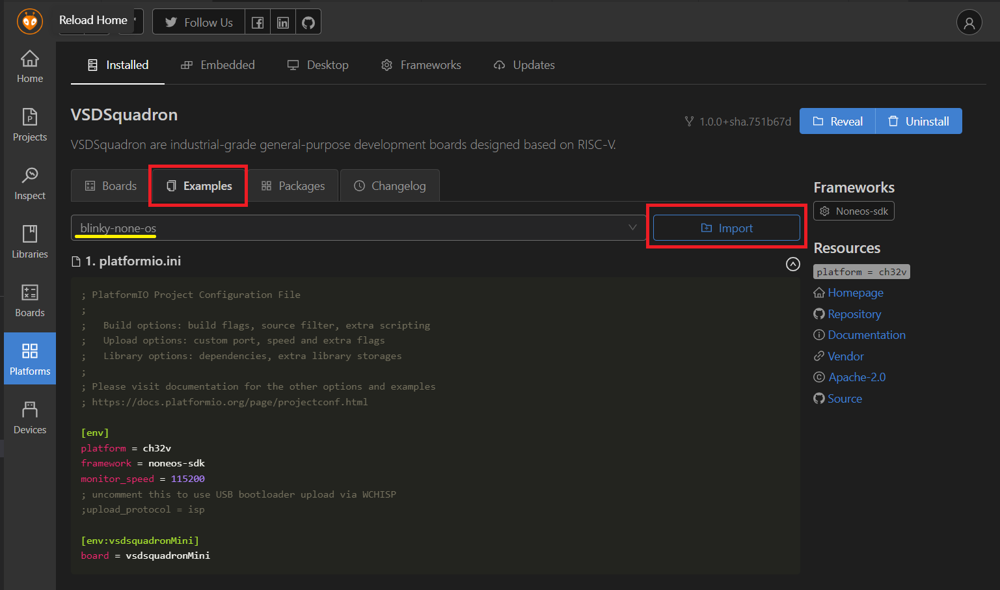
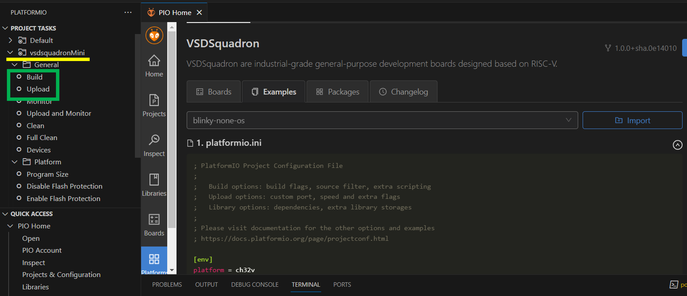
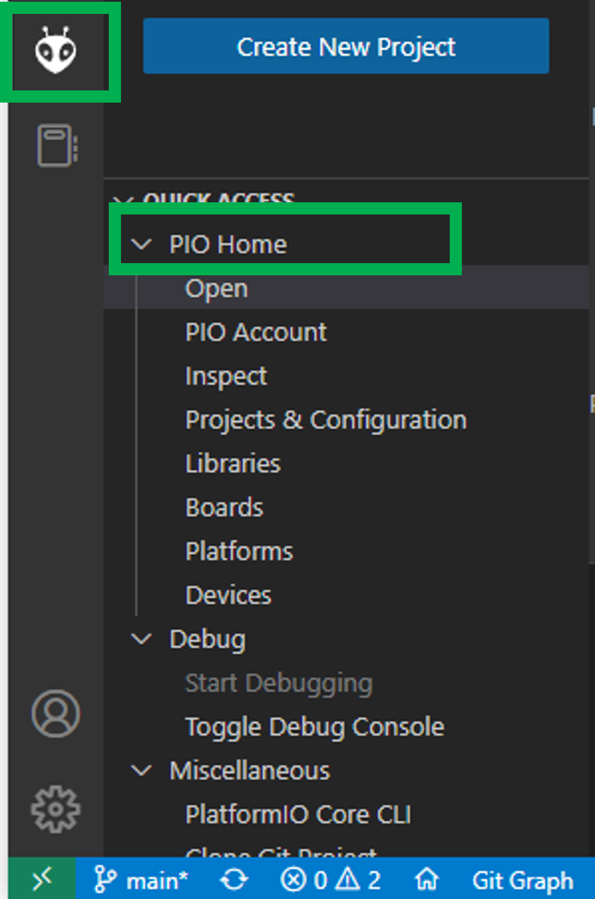
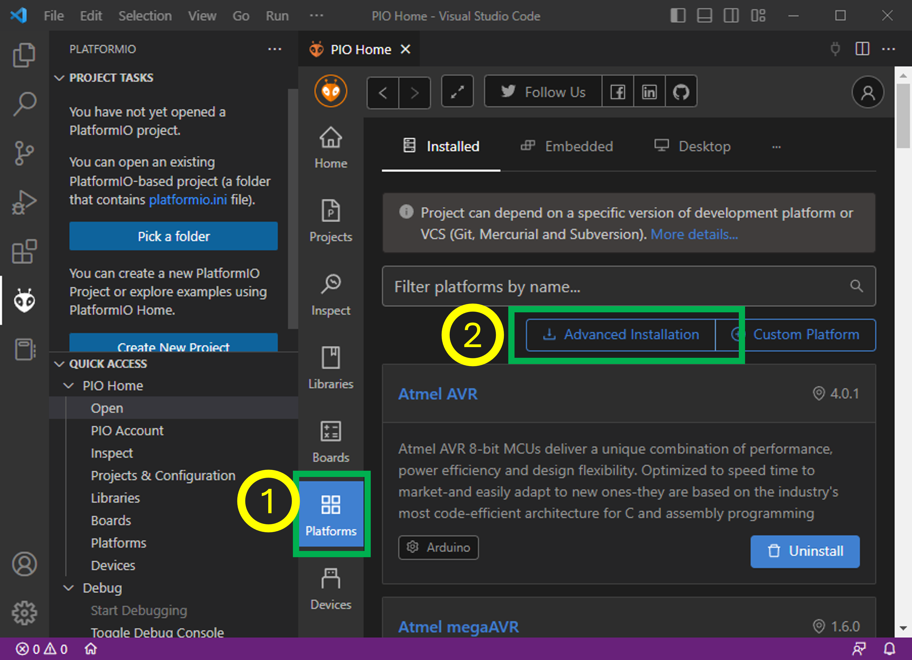

# Workshop Documentation 📚

This repository contains essential documentation for workshop setup and technical specifications.

## 📑 Contents

### 1. Steps To Setup Labs
- Comprehensive guide for laboratory setup
- File: `StepsToSetupLabs.pdf`
- Size: 754.6 KB
- Purpose: Provides detailed instructions for setting up workshop laboratories

### 2. Technical Datasheet
- Detailed technical specifications
- File: `datasheet.pdf`
- Size: 15.9 MB
- Purpose: Contains technical specifications and reference materials

## 🔧 Usage

1. Start with `StepsToSetupLabs.pdf` for initial setup instructions
2. Refer to `datasheet.pdf` for technical specifications and details

## 📌 Important Notes

- Ensure to follow the setup steps in the correct order
- Keep these documents for future reference
- Both PDFs contain crucial information for workshop operation

## 🔄 Updates

Last updated: January 1, 2025

---

# VSDSquadron Mini RISC-V Development Board 🚀

<div align="center">

[](https://github.com/vsdip/vsdsquadron_mini)
[](https://github.com/vsdip/vsdsquadron_mini/wiki)
[](https://vsdsquadron.slack.com/)


  
  <br>
  <em>VSDSquadron Mini: Your Gateway to RISC-V Development</em>
  
  [Quick Start](#quick-start) • [Documentation](#documentation) • [Features](#features) • [Support](#support)
</div>

---

## 🌟 Quick Start

<details>
<summary>Click to expand!</summary>

### Prerequisites
- VSCode
- 100GB free space
- USB Type-C cable
- Windows/Ubuntu OS

### 1. Connect Your Board
<div align="center">
  
  <br>
  <em>Connect USB Type-C as shown</em>
</div>

### 2. Install Required Software
```bash
# 1. Download VSCode
https://code.visualstudio.com

# 2. Install PlatformIO Extension
# 3. Add CH32V Platform
https://github.com/vsdip/vsdsquadron_pio
```

</details>

## 📋 Table of Contents

<details>
<summary>Click to expand!</summary>

- [Overview](#overview)
- [Features](#features)
- [Technical Specifications](#technical-specifications)
- [Getting Started](#getting-started)
  - [Prerequisites](#prerequisites)
  - [Installation Guide](#installation-guide)
- [Board Setup](#board-setup)
- [Programming Guide](#programming-guide)
- [Support](#support)

</details>

## 🎯 Overview

<div align="center">
  
  <br>
  <em>VSDSquadron Mini Block Diagram</em>
</div>

The VSDSquadron Mini is an innovative RISC-V development board designed for education and development. It features the CH32V003F4U6 chip with a 32-bit RISC-V core based on the RV32EC instruction set.

<details>
<summary>Key Highlights</summary>

- 🎯 Perfect for RISC-V learning and development
- 💡 Built-in programmer - no external hardware needed
- 🔌 USB Type-C connectivity
- ⚡ 24MHz system frequency
- 💾 16KB Flash + 2KB SRAM

</details>

## ⚡ Features

<details>
<summary>Core Components</summary>

- **Processor**: CH32V003F4U6 with 32-bit RISC-V core (RV32EC)
- **Clock**: 24MHz system main frequency
- **Memory**: 
  - 2KB SRAM
  - 16KB CodeFlash
  - 1920B Bootloader

</details>

<details>
<summary>Connectivity</summary>

- **GPIO**: 15 I/O ports in 3 groups
- **Communication Interfaces**:
  - USART (PD6-RX, PD5-TX)
  - I2C (PC1-SDA, PC2-SCL)
  - SPI (PC5-SCK, PC1-NSS, PC6-MOSI, PC7-MISO)

</details>

## 🔧 Technical Specifications

<details>
<summary>Board Specifications</summary>

| Parameter | Specification |
|-----------|---------------|
| Form Factor | 50.00 x 28.00 mm |
| I/O Voltage | 3.3V |
| Input Voltage | 5V (USB) |
| Current per I/O Pin | 8mA (Source/Sink) |
| Operating Temperature | 20-35°C (68-95°F) |
| Maximum Component Height | Top: 8mm, Bottom: 1mm |

</details>

<details>
<summary>Detailed Pin Configurations</summary>

### GPIO Assignments
| Interface | Pin Configuration |
|-----------|------------------|
| SPI | PC5(SCK), PC1(NSS), PC6(MOSI), PC7(MISO) |
| I2C | PC1(SDA), PC2(SCL) |
| USART | PD6(RX), PD5(TX) |

### ADC Specifications
- Resolution: 10-bit
- Input channels: PD0-PD7, PA1, PA2, PC4
- Conversion time: Based on APB2 clock
- Reference voltage: 3.3V

### Interrupt Configuration
- 8 external interrupt edge detectors
- Mappable to any of 18 external I/O ports
- Configurable trigger edges (rising/falling)

</details>

## 🖥️ Development Environment Setup

### VDI Setup Instructions

<details>
<summary>Visual Setup Guide</summary>

<div align="center">
  <table>
    <tr>
      <td align="center">
        
        <br>
        <em>Step 1: Create New VM</em>
      </td>
      <td align="center">
        
        <br>
        <em>Step 2: Configure Virtual Disk</em>
      </td>
    </tr>
    <tr>
      <td align="center">
        
        <br>
        <em>Step 3: System Settings</em>
      </td>
      <td align="center">
        
        <br>
        <em>Step 4: USB Configuration</em>
      </td>
    </tr>
  </table>
</div>

</details>

<details>
<summary>Prerequisites</summary>

1. **System Requirements**
   - Minimum 100GB free space on C: or D: drive
   - CPU with virtualization support enabled in BIOS
   - Minimum 8GB RAM recommended
   - Operating System: Windows/Ubuntu

2. **Required Software**
   - Oracle VirtualBox ([Download](https://www.virtualbox.org/wiki/Downloads))
   - VDI file ([Download](https://forgefunder.com/~kunal/vsdsquadron.vdi))

</details>

<details>
<summary>Step-by-Step Installation</summary>

### 1. VirtualBox Installation
- Download and install VirtualBox
- Install VirtualBox Extension Pack for USB support
- Restart your system if prompted

### 2. Virtual Machine Creation
<div align="center">
  
  <br>
  <em>Create a new Virtual Machine with these settings</em>
</div>

```plaintext
Configure VM:
- Name: VSDSquadron
- Type: Linux
- Version: Ubuntu 18.04
- Memory: 4096 MB (recommended)
```

### 3. Virtual Disk Setup
<div align="center">
  
  <br>
  <em>Select the downloaded VDI file</em>
</div>

```plaintext
1. Choose "Use an existing virtual hard disk file"
2. Click the folder icon to browse
3. Select your downloaded VDI file
4. Click "Create"
```

### 4. VM Settings Configuration
<div align="center">
  
  <br>
  <em>Optimize your VM settings</em>
</div>

```plaintext
System Settings:
- Enable EFI
- Enable PAE/NX
- Processor: 2 CPUs
- Enable VT-x/AMD-V

Display Settings:
- Video Memory: 128MB
- Enable 3D Acceleration
- Graphics Controller: VBoxSVGA
```

### 5. USB Configuration
<div align="center">
  
  <br>
  <em>Configure USB settings for device access</em>
</div>

```plaintext
1. Enable USB Controller
2. Select USB 3.0 Controller
3. Add USB device filters if needed
```

### 6. Guest Additions Installation
<div align="center">
  
  <br>
  <em>Install Guest Additions for better performance</em>
</div>

```plaintext
1. Start the VM
2. Click "Devices" → "Insert Guest Additions CD"
3. Follow installation prompts
4. Restart VM when complete
```

</details>

### Troubleshooting VDI Setup

<details>
<summary>Common Issues and Solutions</summary>

1. **Virtualization Errors**
   - **Error**: VT-x/AMD-V hardware acceleration is not available
     ```plaintext
     Solution:
     1. Enter BIOS (usually F2 or Del during boot)
     2. Look for "Virtualization Technology" or "VT-x"
     3. Enable the setting
     4. Save and restart
     ```
   - **Error**: Hyper-V is interfering with VirtualBox
     ```powershell
     # Run in PowerShell as Administrator
     bcdedit /set hypervisorlaunchtype off
     ```

2. **Performance Issues**
   - **Slow VM Performance**
     ```plaintext
     Solutions:
     1. Increase RAM allocation
     2. Enable 3D acceleration
     3. Increase video memory to 128MB
     4. Disable unnecessary VM features
     ```
   - **Laggy Interface**
     ```plaintext
     Solutions:
     1. Install VirtualBox Guest Additions
     2. Enable hardware virtualization
     3. Reduce desktop effects in Ubuntu
     ```

3. **Boot and Startup Issues**
   - **Black Screen on Boot**
     ```plaintext
     Solutions:
     1. Enable EFI in VM settings
     2. Try different graphics controllers
     3. Start in safe graphics mode
     ```
   - **VERR_VMX_MSR_LOCKED_OR_DISABLED Error**
     ```plaintext
     Solutions:
     1. Disable Hyper-V
     2. Remove Hyper-V Windows feature
     3. Restart Windows
     ```

4. **USB and Connectivity Issues**
   - **Device Not Recognized**
     ```plaintext
     Solutions:
     1. Install VirtualBox Extension Pack
     2. Enable USB 3.0 controller
     3. Add user to vboxusers group (Linux)
     ```
   - **Network Connection Failed**
     ```plaintext
     Solutions:
     1. Check adapter settings
     2. Try different adapter types
     3. Reset network configuration
     ```

5. **Storage and Space Issues**
   - **Insufficient Disk Space**
     ```plaintext
     Solutions:
     1. Clean Windows temporary files
     2. Use disk cleanup tools
     3. Move VDI to drive with more space
     ```
   - **VDI File Corruption**
     ```plaintext
     Solutions:
     1. Verify VDI checksum
     2. Try VBoxManage repair
     3. Re-download VDI if necessary
     ```

</details>

<details>
<summary>Performance Optimization Tips</summary>

1. **Virtual Machine Settings**
   ```plaintext
   - Allocate at least 4GB RAM
   - Enable PAE/NX
   - Use VBoxSVGA graphics controller
   - Enable 3D acceleration
   ```

2. **Host System Optimization**
   ```plaintext
   - Close unnecessary applications
   - Disable background services
   - Update VirtualBox to latest version
   - Update host OS drivers
   ```

3. **Guest OS Optimization**
   ```plaintext
   - Install Guest Additions
   - Disable unnecessary services
   - Use lightweight desktop environment
   - Regular system cleanup
   ```

</details>

## 💻 Installation Guide

### 1. VSCode Setup
<div align="center">
  
  <br>
  <em>Step 1: Install PlatformIO Extension</em>
</div>

### 2. PlatformIO Setup
<div align="center">
  
  <br>
  <em>Step 2: Open PlatformIO Home</em>
</div>

### 3. Install CH32V Platform
<div align="center">
  
  <br>
  <em>Step 3: Advanced Installation</em>
</div>

## 🚀 Programming Guide

<details>
<summary>Quick Start Code</summary>

```cpp
// Blink Example
#include "ch32v00x.h"

int main(void) {
    // Initialize LED pin
    GPIO_InitTypeDef GPIO_InitStructure = {0};
    RCC_APB2PeriphClockCmd(RCC_APB2Periph_GPIOD, ENABLE);
    GPIO_InitStructure.GPIO_Pin = GPIO_Pin_6;
    GPIO_InitStructure.GPIO_Mode = GPIO_Mode_Out_PP;
    GPIO_InitStructure.GPIO_Speed = GPIO_Speed_50MHz;
    GPIO_Init(GPIOD, &GPIO_InitStructure);

    while(1) {
        GPIO_WriteBit(GPIOD, GPIO_Pin_6, Bit_SET);   // LED ON
        Delay_Ms(1000);
        GPIO_WriteBit(GPIOD, GPIO_Pin_6, Bit_RESET); // LED OFF
        Delay_Ms(1000);
    }
}
```

</details>

## 🤝 Support

<details>
<summary>Get Help</summary>

- 📧 Email: vsd@vlsisystemdesign.com
- 💬 Slack: https://vsdsquadron.slack.com/
- 📚 Documentation: [CH32V003F4U6 Datasheet](link-to-datasheet)

</details>

## 📝 License

 2024 VLSI System Design (VSD)
